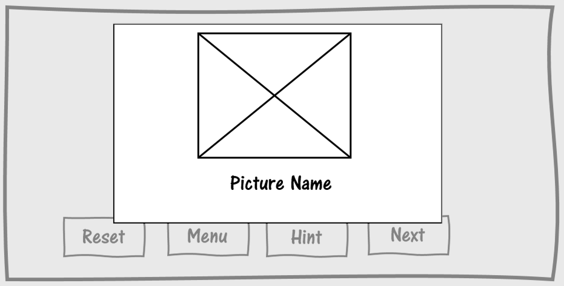

# Project Title
Nonogram puzzle

## Game Link
[Click here to play](https://doaaxv.github.io/nonogram-project/)

## Description
 [Nonogram](https://en.wikipedia.org/wiki/Nonogram) is a picture logic puzzle in which cells in a grid must be colored or left blank according to numbers at the side of the grid to reveal a hidden picture.

 ### Technical Used
 ```
HTML
CSS
SCSS
JavaScript
```
### Wireframes
Landing page

Game page

When users win popup


### User Stories

- As a player I would like a landing page with a start button to start the game.
- As a player I would like an instruction popup in the landing page.
- As a player I would like to use hints.
- As a player I would like to eliminate the wrong cells with an 'X' mark.
- As a player I would like a popup of the full picture when I win.

## Planning and Development Process

Day 1
- Started with basic HTML and executed the game logic.
- Worked on making the game grid dynamic so it fits different levels.

Day 2
- Added new levels.
- Created the landing page.
- Started Styling with CSS and SCSS.
- Started writing the hint function logic.

Day 3
- Fixed a bug in the game logic.
- Added popup for when the user wins.
- Continued working on the style.
- Added flashes animation to the hint function

Day 4
- Finalized the hint function
- Organized the code
- Worked on the Readme file

### Problem-Solving Strategy

Used console.log() in Javascript to check if conditions, functions and variable are working correctly.

## Acknowledgments

I would like to thank my instructors and classmates for their motivation and encouragement, I had a lot of fun making this project and it only made me more excited for what's coming next.

## References

Styling:
- https://codepen.io/gau/pen/XJZZmG
- https://hugogiraudel.com/2013/07/15/understanding-sass-lists/

Audio:
- https://www.melodyloops.com/my-music/longoloops/ambient-flight/

animation:
- https://daneden.github.io/animate.css/
- https://github.com/daneden/animate.css/

popups:
- https://sweetalert.js.org/docs/
- https://sweetalert2.github.io/

Gif:
- https://giphy.com/gifs/internet-eoxomXXVL2S0E

